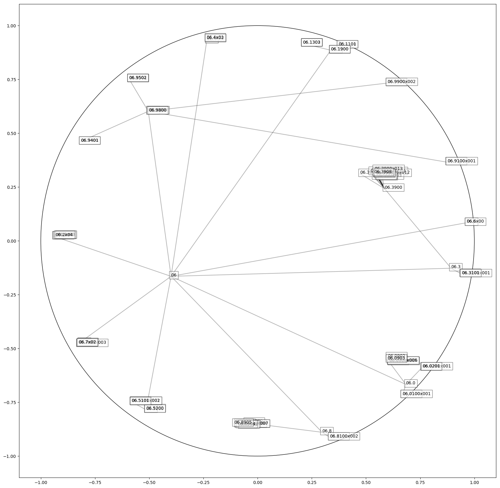

# Poincare embedding for ICD coding pytorch
- pytorch implementation of poincare embedding to ICD coding hierarchy(chinese version of ICD-9-CM3 procedure codes hierarchy), similar to __[Poincaré embeddings for learning hierarchical representations](https://papers.nips.cc/paper/2017/file/59dfa2df42d9e3d41f5b02bfc32229dd-Paper.pdf)__, the idea of modelling ICD hierarchy in hypobolic space is taken from __[HyperCore: Hyperbolic and Co-graph Representation for Automatic ICD Coding](https://www.aclweb.org/anthology/2020.acl-main.282.pdf)__.
- Dependencies:
  - pytorch
  - treelib
  - tqdm
  - matplotlib
- `manifolds` package and `RiemannianSGD` function are taken from __[facebook's implementation](https://github.com/facebookresearch/poincare-embeddings)__:
- run `ICD_main.py` to get 2d visualization of ICD hierarchy on the Poincare ball.
- This code is licensed under __[CC-BY-NC 4.0]([https://creativecommons.org/licenses/by-nc/4.0/)__.

